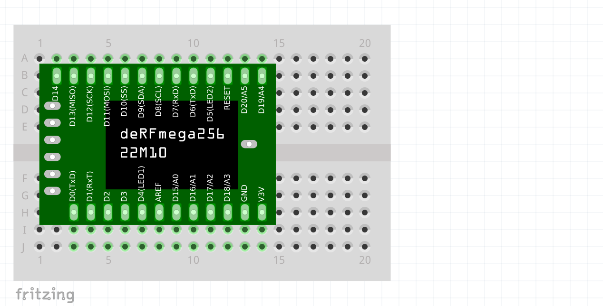

# Fritzing for the Merkur Breakout Board
A Fritzing Library of parts for the Merkur Breakout Board http://wiki.osdomotics.com/doku.php/en:projekte:merkur#pinouts.

The open source hardware Merkur Breakout Board is an Arduino :copyright: compatible microcontroller board. With firmware based on the contiki-OS fork https://github.com/osdomotics/osd-contiki it includes low power wireless mesh network capabilities with IPv6 address. The PCB is a DIP26 800mil format board.

## Motivation

I am using breadboards to prototype circuitry for my Merkur Breakout Board projects. It is perfect to document and share these projects using Fritzing (way better than sending fotos and faster than drawing by hand).

## Usage

### Install Fritzing Version 0.9.3b or higher
http://fritzing.org/download/ (only tested version is 0.9.3b, maybe older versions work too)

### Import the Part(s) into Fritzing

1. Start Fritzing.
2. Click on MINE in the Part window.
3. Right click on the blank background area under My Parts.
4. Click Import and select "MerkurBreakoutBoard.fzpz" from the `build` directory.

### Use in your Fritzing Project

## How it was made

Breadboard svg source file `$2` created from Merkur Breakout Board Eagle exported to PDF `$1` using:

`inkscape --without-gui --file=$1 --export-plain-svg=$2`

Modified a core Fritzing IC part in inspector window. Then Fritzing parts editor was used for the modified part to load the above breadboard svg image, to name and assign connections and to auto-generate the other svg source files. 
See https://learn.sparkfun.com/tutorials/make-your-own-fritzing-parts sections "Using an IC as a Starting Point" and "Breadboard View - Parts Editor". 
Breadboard, schematic and PCB svg source files were manually edited using text editor. 

Be aware, PCB file does **not** have exact dimensions. 

## Contributions

Created by Thomas Reininghaus (2017)

This readme is based on https://github.com/technobly/SparkCore-Photon-Fritzing and https://github.com/mcauser/Fritzing-Part-Micro-Python-pyboard

## License

 This work is licensed under a <a rel="license" href="http://creativecommons.org/licenses/by-sa/3.0/">Creative Commons Attribution-ShareAlike 3.0 Unported License</a>.
